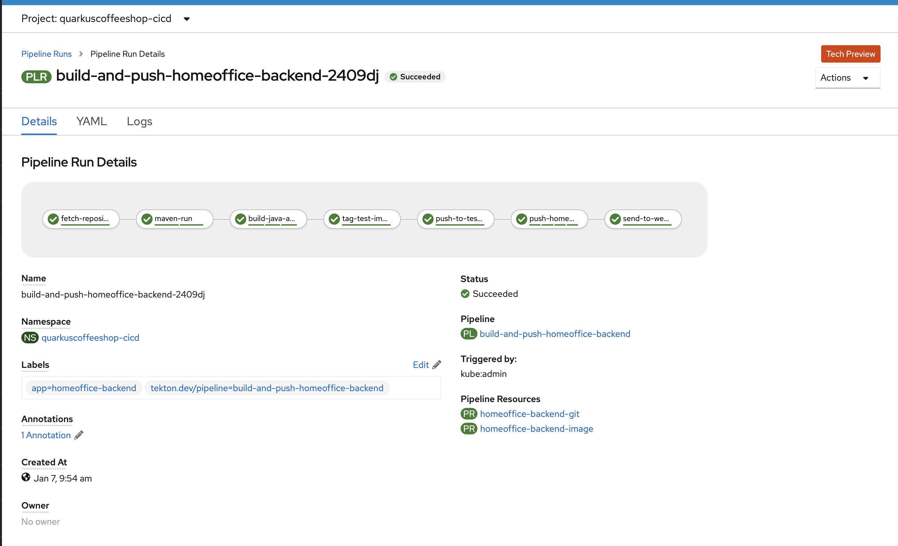

## homeoffice-backend tekton pipeline



## Deploy pipelines using kustomize
---
> You may fork this repo and make edit to the `application-deployment/homeoffice/homeoffice-backend/transformer-patches.yaml` in for GitOps or argocd
**Create Projects**
```
oc new-project quarkuscoffeeshop-cicd
oc new-project quarkuscoffeeshop-homeoffice
oc adm policy add-role-to-user admin system:serviceaccount:quarkuscoffeeshop-homeoffice:pipeline -n quarkuscoffeeshop-cicd
oc policy add-role-to-group system:image-puller system:serviceaccounts:quarkuscoffeeshop-homeoffice -n quarkuscoffeeshop-cicd
oc adm policy add-role-to-user admin system:serviceaccount:quarkuscoffeeshop-cicd:pipeline -n quarkuscoffeeshop-homeoffice
```

**Run the kustomize command to deploy pipelines** 
```
kustomize build homeoffice-backend | oc create -f - 
```

**Update Environment Variables in deployment**
```
oc edit deployment.apps/homeoffice-backend
```

## Deploy pipelines Manually 
---
**configure pvc**
```
oc -n quarkuscoffeeshop-cicd create -f homeoffice-backend/pvc/pvc.yml
oc -n quarkuscoffeeshop-cicd create -f  ./homeoffice-backend/pvc/maven-source-pvc.yml
```

**configure Tasks**
```
oc -n quarkuscoffeeshop-cicd create -f ./common-functions/tasks/git-clone.yaml
oc -n quarkuscoffeeshop-cicd create -f ./common-functions/tasks/openshift-client-task.yaml
oc -n  quarkuscoffeeshop-cicd create -f ./common-functions/tasks/maven.yaml
```

**Configure push image to quay task**
```
oc -n  quarkuscoffeeshop-cicd create -f ./homeoffice-backend/tektontasks/pushImageToQuay.yaml
```

**configure Resources**
```
oc -n quarkuscoffeeshop-cicd create -f  ./homeoffice-backend/resources/git-pipeline-resource.yaml
oc -n quarkuscoffeeshop-cicd create -f  ./homeoffice-backend/resources/image-pipeline-resource.yaml
```

**Create Pipeline**
```
oc -n quarkuscoffeeshop-cicd create -f  ./homeoffice-backend/pipeline/deploy-pipeline.yaml
```


### Integration testing instructions 
**Create Projects**
```
oc new-project quarkuscoffeeshop-cicd
oc new-project quarkuscoffeeshop-homeoffice
oc adm policy add-role-to-user admin system:serviceaccount:quarkuscoffeeshop-homeoffice:pipeline -n quarkuscoffeeshop-cicd
oc policy add-role-to-group system:image-puller system:serviceaccounts:quarkuscoffeeshop-homeoffice -n quarkuscoffeeshop-cicd
oc adm policy add-role-to-user admin system:serviceaccount:quarkuscoffeeshop-cicd:pipeline -n quarkuscoffeeshop-homeoffice
```

**Deploy Application**
```
oc create -f application-deployment/homeoffice/homeoffice-backend/ -n quarkuscoffeeshop-homeoffice
oc expose service/homeoffice-backend -n quarkuscoffeeshop-homeoffice
```

**Update Environment Variables in deployment**
```
oc edit deployment.apps/homeoffice-backend 
```