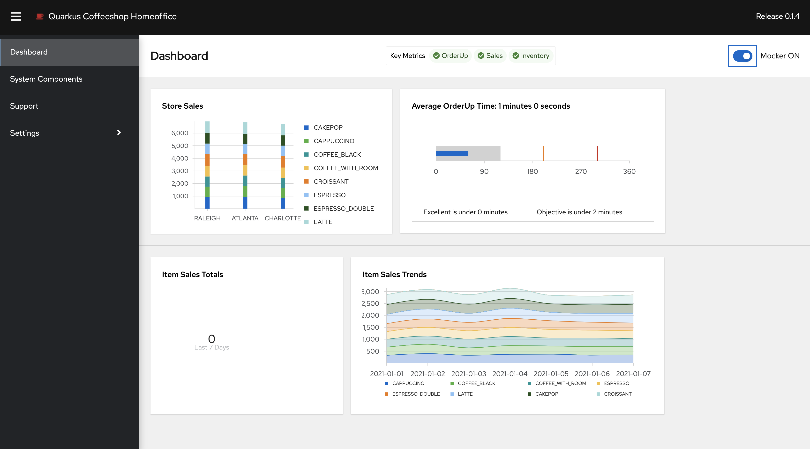
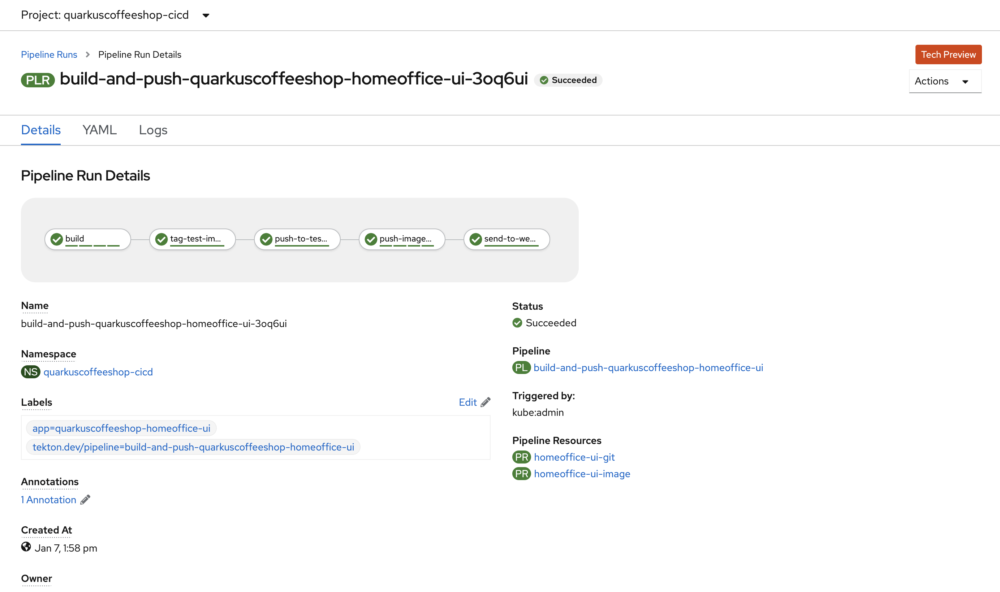

## quarkuscoffeeshop-homeoffice-ui tekton pipeline




**configure pvc**
```
oc -n quarkuscoffeeshop-cicd create -f quarkuscoffeeshop-homeoffice-ui/pvc/pvc.yml
```

**configure Tasks**
```
oc -n quarkuscoffeeshop-cicd create -f ./common-functions/tasks/openshift-client-task.yaml
oc -n quarkuscoffeeshop-cicd create -f ./quarkuscoffeeshop-homeoffice-ui/tektontasks/s2i-nodejs-task.yaml
oc -n  quarkuscoffeeshop-cicd create -f ./quarkuscoffeeshop-homeoffice-ui/tektontasks/pushImageToQuay.yaml
```

**configure Resources**
```
oc -n quarkuscoffeeshop-cicd create -f  ./quarkuscoffeeshop-homeoffice-ui/resources/image-pipeline-resource.yaml
oc -n quarkuscoffeeshop-cicd create -f  ./quarkuscoffeeshop-homeoffice-ui/resources/git-pipeline-resource.yaml
```

**Create Pipeline**
```
oc -n quarkuscoffeeshop-cicd create -f  ./quarkuscoffeeshop-homeoffice-ui/pipeline/deploy-pipeline.yaml
```

**Create GitHub Trigger for Pipeline**
```
oc -n quarkuscoffeeshop-cicd create -f ./triggerbinding-configs/webhook-roles.yaml
oc -n quarkuscoffeeshop-cicd create -f ./triggerbinding-configs/github-triggerbinding.yaml
WEBHOOK_SECRET="$(openssl rand -base64 12)"
oc -n quarkuscoffeeshop-cicd create secret generic webhook-secret --from-literal=secret=${WEBHOOK_SECRET}
echo ${WEBHOOK_SECRET} > saved-secert.txt
sed -i "s/<git-triggerbinding>/github-triggerbinding/" ./quarkuscoffeeshop-homeoffice-ui/webhook.yaml
sed -i "/ref: github-triggerbinding/d" ./quarkuscoffeeshop-homeoffice-ui/webhook.yaml
sed -i "s/- name: pipeline-binding/- name: github-triggerbinding/" ./quarkuscoffeeshop-homeoffice-ui/webhook.yaml
oc -n quarkuscoffeeshop-cicd create -f  ./quarkuscoffeeshop-homeoffice-ui/webhook.yaml
```

**Create HomeOffice Webhook**
```
oc -n quarkuscoffeeshop-cicd create route edge homeoffice-ui-webhook --service=el-homeoffice-ui-webhook --port=8080 --insecure-policy=Redirect

oc -n quarkuscoffeeshop-cicd  get route homeoffice-ui-webhook -o jsonpath='https://{.spec.host}'

```

Configure web hook for quarkuscoffeeshop-homeoffice-ui

    > **NOTE**: Every Git server has its own properties, but basically you want to provide the ingress url for our webhook and when the Git server should send the hook. E.g: push events, PR events, etc.

    1. Go to your application repository on GitHub, eg: https://github.com/quarkuscoffeeshop/quarkuscoffeeshop-homeoffice-ui
    2. Click on `Settings` -> `Webhooks`
    3. Create the following `Hook`
       1. `Payload URL`: Output of command `oc -n quarkuscoffeeshop-cicd  get route homeoffice-ui-webhook -o jsonpath='https://{.spec.host}'`
       2. `Content type`: application/json
       2. `Secret`: v3r1s3cur3 `cat saved-secert.txt`
       3. `Events`: Check **Push Events**, leave others blank
       4. `Active`: Check it
       5. `SSL verification`: Check  **Disable**
       6. Click on `Add webhook`


### Integration testing instructions 
```
oc adm policy add-role-to-user admin system:serviceaccount:quarkuscoffeeshop-homeoffice:pipeline -n quarkuscoffeeshop-cicd
oc policy add-role-to-group system:image-puller system:serviceaccounts:quarkuscoffeeshop-homeoffice -n quarkuscoffeeshop-cicd
oc adm policy add-role-to-user admin system:serviceaccount:quarkuscoffeeshop-cicd:pipeline -n quarkuscoffeeshop-homeoffice

oc project quarkuscoffeeshop-homeoffice
oc new-app quarkuscoffeeshop-cicd/quarkuscoffeeshop-homeoffice-ui:latest -n quarkuscoffeeshop-homeoffice
oc expose svc quarkuscoffeeshop-homeoffice-ui -n quarkuscoffeeshop-homeoffice
```