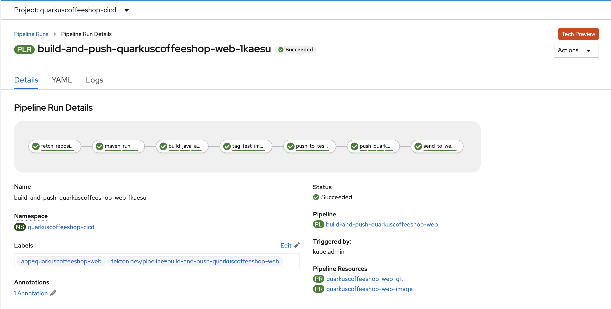

# quarkuscoffeeshop-web tekton pipeline



## Deploy pipelines using Kustomize
> You may fork this repo and make edit to the `application-deployment/store/quarkuscoffeeshop-web/transformer-patches.yaml` in for GitOps or argocd
---
**Create Projects and configure permissions**
```
oc new-project quarkuscoffeeshop-cicd
oc new-project quarkuscoffeeshop-demo
oc adm policy add-role-to-user admin system:serviceaccount:quarkuscoffeeshop-demo:pipeline -n quarkuscoffeeshop-cicd
oc policy add-role-to-group system:image-puller system:serviceaccounts:quarkuscoffeeshop-demo -n quarkuscoffeeshop-cicd
oc adm policy add-role-to-user admin system:serviceaccount:quarkuscoffeeshop-cicd:pipeline -n quarkuscoffeeshop-demo
```
**Run the Kustomize command to deploy pipelines** 
```
kustomize build quarkuscoffeeshop-web | oc create -f - 
```

**Update Environment Variables in deployment**
```
oc edit deployment.apps/quarkuscoffeeshop-web  -n quarkuscoffeeshop-demo
```

## Deploy pipelines Manually 
---
**configure pvc**
```
oc -n quarkuscoffeeshop-cicd create -f quarkuscoffeeshop-web/pvc/pvc.yml
oc -n quarkuscoffeeshop-cicd create -f  ./quarkuscoffeeshop-web/pvc/maven-source-pvc.yml
```


**configure Tasks**
```
oc -n quarkuscoffeeshop-cicd create -f ./common-functions/tasks/git-clone.yaml
oc -n quarkuscoffeeshop-cicd create -f ./common-functions/tasks/openshift-client-task.yaml
oc -n  quarkuscoffeeshop-cicd create -f ./common-functions/tasks/maven.yaml
```

**Configure push image to quay task**
```
oc -n  quarkuscoffeeshop-cicd create -f ./quarkuscoffeeshop-web/tektontasks/pushImageToQuay.yaml
```

**configure Resources**
```
oc -n quarkuscoffeeshop-cicd create -f  ./quarkuscoffeeshop-web/resources/git-pipeline-resource.yaml
oc -n quarkuscoffeeshop-cicd create -f  ./quarkuscoffeeshop-web/resources/image-pipeline-resource.yaml
```

**Create Pipeline**
```
oc -n quarkuscoffeeshop-cicd create -f  ./quarkuscoffeeshop-web/pipeline/deploy-pipeline.yaml
```


### Integration testing instructions 
```
oc adm policy add-role-to-user admin system:serviceaccount:quarkuscoffeeshop-demo:pipeline -n quarkuscoffeeshop-cicd
oc policy add-role-to-group system:image-puller system:serviceaccounts:quarkuscoffeeshop-demo -n quarkuscoffeeshop-cicd
oc adm policy add-role-to-user admin system:serviceaccount:quarkuscoffeeshop-cicd:pipeline -n quarkuscoffeeshop-demo

oc project quarkuscoffeeshop-demo
oc create -f application-deployment/store/quarkuscoffeeshop-web/quarkuscoffeeshop-web.yaml -n quarkuscoffeeshop-demo
oc expose svc/quarkuscoffeeshop-web    
```

**Update Enviornment Variables in deployment**
```
oc edit deployment.apps/quarkuscoffeeshop-web
```